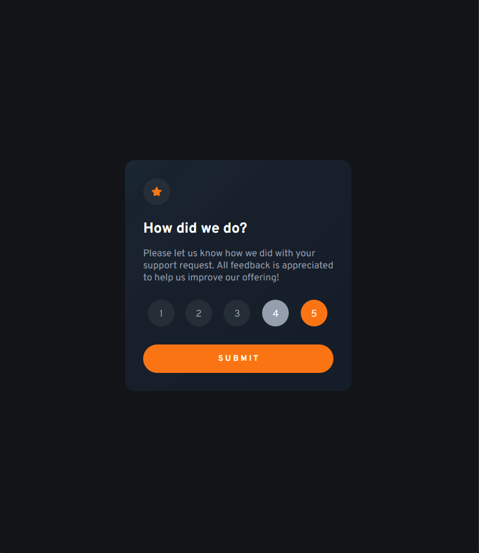
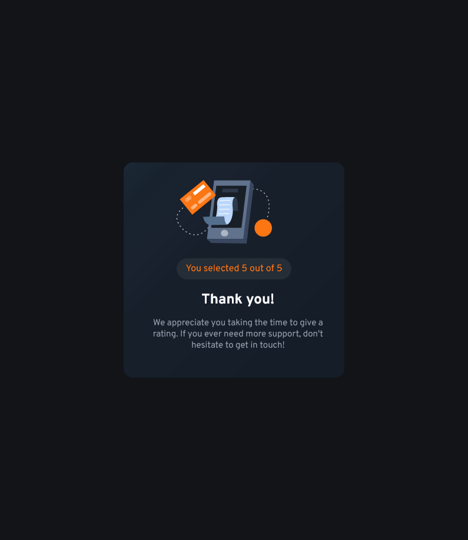

# Frontend Mentor - Interactive rating component solution

This is a solution to the [Interactive rating component challenge on Frontend Mentor](https://www.frontendmentor.io/challenges/interactive-rating-component-koxpeBUmI). Frontend Mentor challenges help you improve your coding skills by building realistic projects.

## Table of contents

- [Overview](#overview)
  - [The challenge](#the-challenge)
  - [Screenshot](#screenshot)
  - [Links](#links)
- [My process](#my-process)
  - [Built with](#built-with)
  - [What I learned](#what-i-learned)
  - [Continued development](#continued-development)
  - [Useful resources](#useful-resources)
- [Author](#author)
- [Acknowledgments](#acknowledgments)

## Overview

### The challenge

Users should be able to:

- View the optimal layout for the app depending on their device's screen size
- See hover states for all interactive elements on the page
- Select and submit a number rating
- See the "Thank you" card state after submitting a rating

### Screenshot

## Active State

~~there is a cursor:pointer but it didnt show in the print~~




### Links

- Solution URL: [Add solution URL here](https://your-solution-url.com)
- Live Site URL: [Add live site URL here](https://your-live-site-url.com)

## My process

### Built with

- Semantic HTML5 markup
- CSS custom properties
- Flexbox
- CSS Grid
- Mobile-first workflow

### What I learned

I learned alot in this project that i tought it would be quite easy to develop, first of all, that was my first time messing with forms and how to manipulate them, of course not that deep but still.

Something that i also enjoyed alot was playing with localStorage ( the pros and cons ) and the window methods, for example :

```js
window.location.href = `thank-you.html?rating=${ratingValue} // It redirects me to the thank-you.html page
```

And believe it or not, CSS! Obviously i don't love it all the time but it is very very cool to "assemble" your site and comparing it bit by bit to the project that you're given.

### Continued development

Something that got stuck in my mind is to validate the form and don't let the user be able to Submit if the rating is not chosen.

### Useful resources

- [Example resource 1](https://www.w3schools.com/) - As always, this site ALWAYS helps me.
- [Example resource 2](https://www.section.io/engineering-education/how-to-use-localstorage-with-javascript/) - This is an amazing article which helped me understand localStorage in my first try. I'd recommend it to anyone still learning this concept.

## Author

- Github - [Ravimasi](https://github.com/Ravimasi)
- Frontend Mentor - [@ravimasi](https://www.frontendmentor.io/profile/Ravimasi)

## Acknowledgments

Asking ChatGPT when i got stuck really saved me some time because i found some very antique webposts, like 9~10 years old.
